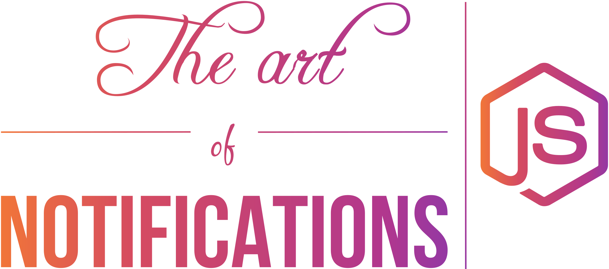

<p align="center">
  <a href="">
    
  </a>
</p>

<p align="center">
   Simple example on how to deliver iOS Push Notifications with Node.js.
</p>

## Table of Contents

- [Introduction](#introduction)
- [Usage](#usage)
- [More Help](#more-help)
- [Credits](Credits)
- [License](#license)

## Introduction

This code sample shows how to create a web provider for your push notifications
which interfaces with the [Apple Push Notification Service (APNS)](https://developer.apple.com/library/ios/documentation/NetworkingInternet/Conceptual/RemoteNotificationsPG/Chapters/ApplePushService.html)
using [Node.js](https://nodejs.org/en/) and the amazing
[node-apn](https://github.com/argon/node-apn) module.

The sample was originally used in [this workshop](https://speakerdeck.com/ythecombinator/the-art-of-notifications).

## Usage

1. Make sure you have [Git](https://git-scm.com/) and
[Node.js](https://nodejs.org/en/) installed.

1. Clone this repo:
```sh
git clone https://github.com/bepid-ifce/push_notifications-node.git
```

1. Enter the repo directory:
```sh
cd push_notifications-node
```

1. Install all dependencies:
```sh
npm install
```

1. Add your `cert.pem` and `key.pem` files to the project root - you can find
more info on this [here](#more-help)

1. Add at least one device token [here](data/devices.json)

1. Uncomment the function calls you want to test in the [`index.js`](index.js):
```js
...

connect(service);

same(service, tokens); // Uncomment this line to push the same notifications to each device from devices.json

different(service, tokens); // Uncomment this line to push different notifications to each device from devices.json
```

## More Help

If you're still confused with all the process of push notifications to *iOS*,
you can find a pretty good tutorial
[here](http://www.appcoda.com/push-notification-ios/) and a good help on how to
generate your certicates
[here](https://github.com/argon/node-apn/wiki/Preparing-Certificates).

## Credits

Nothing of this would be possible without the amazing
[node-apn](https://github.com/argon/node-apn) module.

## License

[Push Notifications Node.js](https://github.com/bepid-ifce/push_notifications-node)
is distributed under the MIT License, available in this repository. All
contributions are assumed to be also licensed under the MIT License.
